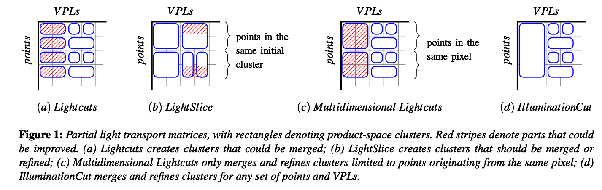

# Illumination cut 

---

Paper comments for illumination cut.

## Abstract

Main:

- This is an extension of multidimensional lightcuts techniques, with optimized clustering techniques.
- Reduce visibility queries by adaptive sampling techniques.

## 1. Introduction

- Unbiased take long, PM/PBR/IR alleviate noise.
- Light cuts builds a tree on VPLs where each node represents a cluster of VPLs in subtree of that node. But each point with different light cut, and descending in tree is expensive.
- LightSlice grouped point-clusters (shading points), then do point-cluster-wise lightcuts. But no error bound, and if radiance of points within a group is highly varying will fail.
- Illumination cut idea: cluster point-VPL pairs.
- 
- Difference with Multidimensional Light-cuts approach

## 2. Related Work
- SIGGRAPH 2012 course and EG state-of-the-art report still good 
- Real-tiem techniques, including few hundres of VPLs, using imperfect shadow maps etc. Good review: Instant Radiosity for Real-Time Global Illumination. Imperfect Shadow Maps for Efficient Computation of Indirect Illumination.
- Extensions & limitations methods increase rendering quality & extend IR's usage.
- To avoid rendering all VPL-point pairs, there are two obvious method.
- Sampling: importance sampling VPLs.
- Clustering: MRCS & Lightcuts. TODOs: read all paper in this section

## Core Idea

- Traverse both tree, until there is a connection which satisfied the geometry condition.
- Use the approximated illumination as Lmin.
- Use this formula: (Lq - Lmin) < 0.01 * Lmin as threshold.
- Also use two trees for actual illumination.

## Result

3-8 times faster than LC & LS (lightcuts & lightslice).